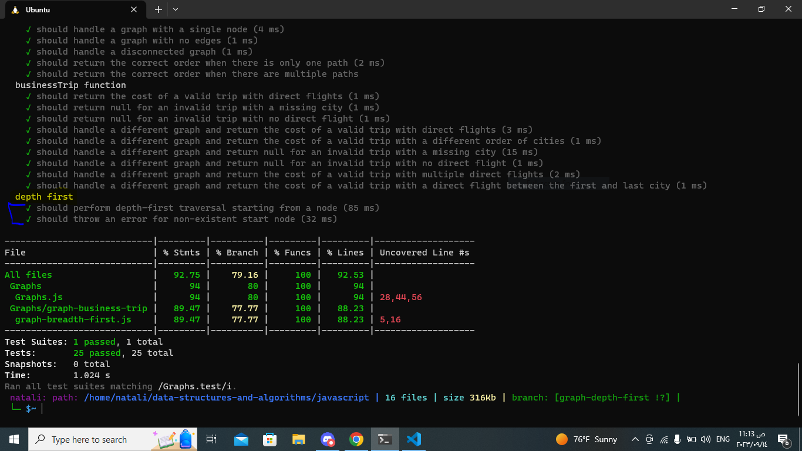

## Depth First 

### Description:
In this challenge, the task is to create a method named "Depth first" for a Graph class. This method should take a starting node as an argument and return a collection of nodes in their pre-order depth-first traversal order. Additionally, the program should display this collection as the output.
_ _ _
### white board:
.jpg)
_ _ _
### Approach:
1. use a recursive approach to perform the depth-first traversal. This approach is intuitive and simple to implement.
2. start from the given starting node and mark it as visited.
3. For each unvisited neighbor of the current node, recursively call the DFS function on that neighbor.
4. During the traversal, keep track of the visited nodes and add them to the result collection in pre-order.
5. Finally, return the collection of nodes in pre-order depth-first traversal order.
_ _ _
### Efficiency:
- Time Complexity: The time complexity of this depth-first traversal is O(V + E), where V is the number of vertices (nodes) and E is the number of edges in the graph.

- Space Complexity: The space complexity is O(V), where V is the number of vertices.
_ _ _
### Solution:
- [code](../Graphs.js)

- [test](../Graphs.test.js)
_ _ _

