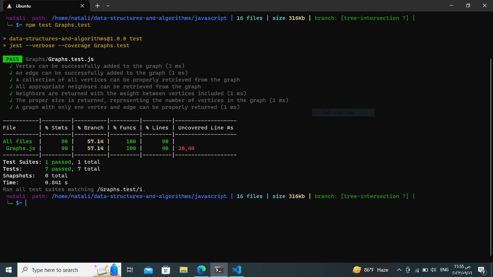

## Graphs

### Description:
In this challenge, the task is to implement a Graph data structure using an adjacency list representation. A graph consists of vertices (nodes) and edges that connect pairs of vertices. The graph class should include methods to add vertices, add edges between vertices, retrieve vertices and their neighbors, and determine the size of the graph.
_ _ _
### Approach:
The implementation of the Graph class involves creating two additional classes: Vertex and Edge.

- Vertex Class:

The Vertex class holds the value of the vertex and an array to store its edges.
Each vertex has a value and an associated list of edges connected to it.

- Edge Class:
The Edge class represents an edge between two vertices.
Each edge has a reference to the destination vertex and an optional weight.
Graph Class:

- The Graph class maintains a Map that associates each vertex with its list of edges.

- The class provides methods to:
1. Add vertices (addVertex).
2. Add edges (addEdge).
3. Get vertices (getVertices).
4. Get neighbors (getNeighbors).
5. Determine size (size).
_ _ _
### Efficiency:
- Adding a vertex is O(1).
- Adding an edge is O(1).
- Retrieving all vertices is O(V), where V is the number of vertices.
- Retrieving neighbors of a vertex is O(E), where E is the number of edges connected to the vertex.
- Determining the size is O(1) as it involves returning the size of the map.
_ _ _
### Solution:
- [code](./Graphs.js)

- [test](./Graphs.test.js)
_ _ _

