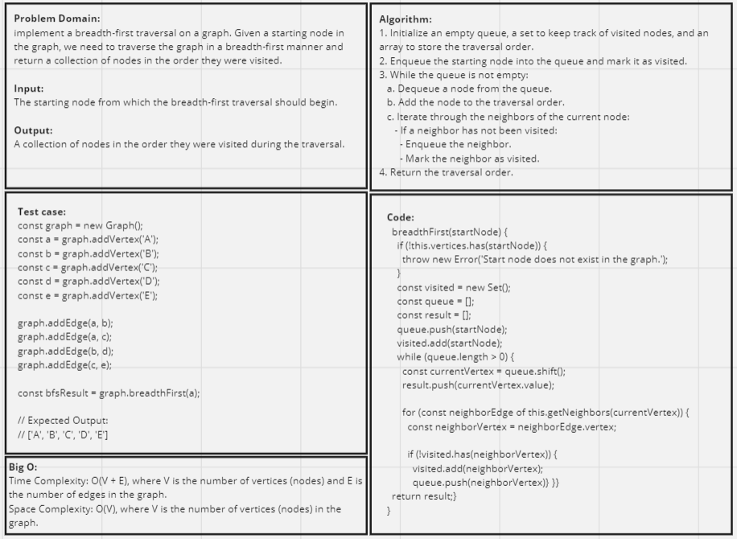

## Implement a breadth-first traversal on a graph.

### Description:
In this challenge, the task is to implement a breadth-first traversal on a graph. A breadth-first traversal explores a graph by visiting all the nodes at the current level before moving on to nodes at the next level. This traversal technique helps in finding the shortest path between nodes in an unweighted graph and is useful for various graph-related problems.
_ _ _
### Whiteboard

_ _ _
### Approach:
- Initialize an empty queue, a set to keep track of visited nodes, and an array to store the traversal order.
- Enqueue the starting node into the queue and mark it as visited.
- While the queue is not empty: 
1. Dequeue a node from the queue. 
2. Add the node to the traversal order. 
3. Iterate through the neighbors of the current node:
- If a neighbor has not been visited:
- Enqueue the neighbor.
- Mark the neighbor as visited.
- Return the traversal order.

### Efficiency:
- Time Complexity: O(V + E)
- Space Complexity: O(V)
_ _ _
### Solution:
[graph-breadth-first code](../Graphs.js)

[graph-breadth-first test](../Graphs.test.js)
_ _ _
### Testing
