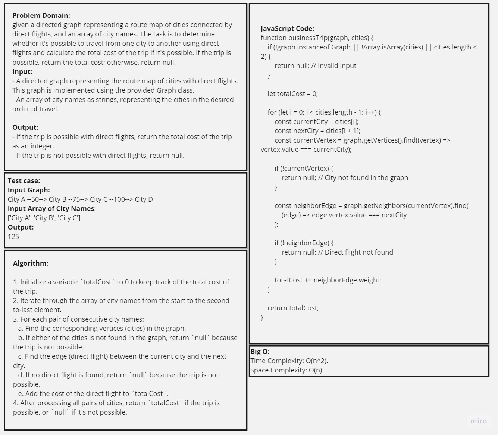
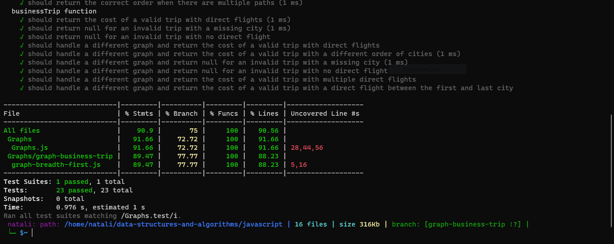

### Description:
The code challenge involves implementing a function called businessTrip that takes a graph representing a route map of cities and an array of city names as input. The goal is to determine whether it's possible to travel from one city to another using direct flights and calculate the total cost of the trip if it's possible. If the trip is possible, the function returns the total cost; otherwise, it returns null.
_ _ _
### Whiteboard:

_ _ _
### Efficiency and Approach:
1. the function checks for invalid inputs, such as an invalid graph or an array of city names with less than two elements. If any of these conditions are met, it returns null.

2. It then iterates through the array of city names, examining each consecutive pair of cities.

3. for each pair of cities, it searches for the corresponding vertices (representing cities) in the graph. If either city is not found in the graph, the function returns null since the trip is not possible.

4. it looks for an edge (direct flight) between the current city and the next city in the graph. If there is no direct flight between these cities, the function returns null.

5. If a direct flight is found, the cost of the flight is added to the totalCost variable.

6. returns the totalCost if the trip is possible, or null if it's not possible.

#### Big O:
- Time Complexity: O(n^2)
- Space Complexity: O(n)
_ _ _
### Solution:
[Graph Business Trip code](./graph-breadth-first.js)

[Graph Business Trip test](../Graphs.test.js)
_ _ _
### Testing:

