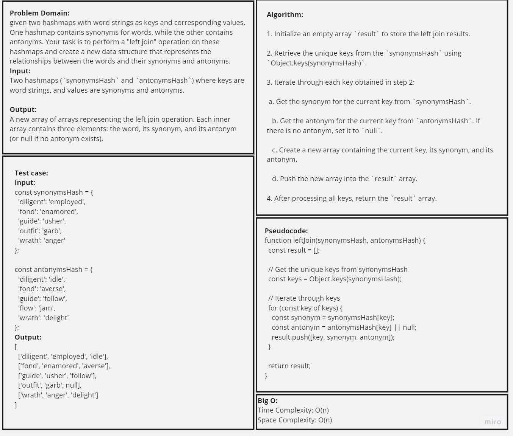
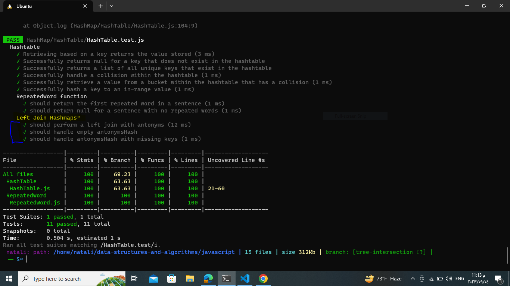

## Left Join Two Hash Maps

### Description:
the task is to implement a Graph data structure using an adjacency list representation. A graph consists of vertices (nodes) and edges that connect pairs of vertices. The graph class should include methods to add vertices, add edges between vertices, retrieve vertices and their neighbors, and determine the size of the graph.
_ _ _
### Whiteboard

_ _ _
### Efficiency Analysis
Time Complexity: O(n), where n is the number of unique keys in the synonymsHash hashmap.
Space Complexity: The space complexity is also O(n), where n is the number of unique keys. We store the result in a new array, which contains n elements.
_ _ _
### Approach
1. Initialize an empty array result to store the left join results.
2. Retrieve the unique keys from the synonymsHash using Object.keys(synonymsHash).
3. Iterate through each key obtained in step 2:
- Get the synonym for the current key from synonymsHash.
- Get the antonym for the current key from antonymsHash. If there is no antonym, set it to null.
- Create a new array containing the current key, its synonym, and its antonym.
- Push the new array into the result array.
4. After processing all keys, return the result array.
_ _ _
-[Code as Method in the class](../HashTable/HashTable.js)

-[tests](../HashTable/HashTable.test.js)
_ _ _
