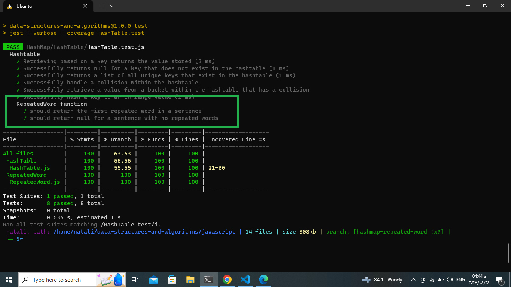

## Repeated Word:

### Descibtion :
The "repeatedWord" function takes an input string and is designed to find and return the first repeated word in the given string.
_ _ _

### White Board:
.jpg)
_ _ _ 

### Approach and Efficiency:

#### Approach:

1. The function takes a single parameter string representing the input sentence.

2. Split the input string into an array of words,Store this array in the arr variable.

3. Create an empty object called RepeatedWord to keep track of word occurrences.

4. Loop through each word in the arr array using an index i.

5. Inside the loop, check if the current word arr[i] doesn't exist as a key in the RepeatedWord dictionary. 
6. If the word is not in the dictionary, add it as a key and set its value to 1 (indicating its first occurrence). This step is essential for tracking whether the word is repeated.

7. If the word is already in the dictionary, return the word using return arr[i], as it's the first repeated word encountered.

8. If the loop completes without finding any repeated words, return null to indicate that no repeated word was found.

### Efficiency:

- Time Complexity: O(n).
- Space Complexity: O(n).
_ _ _

### Code and Testing:
- [Code](./RepeatedWord.js)
- [Testing](../HashTable/HashTable.test.js) 
_ _ _ 

### testing image:
