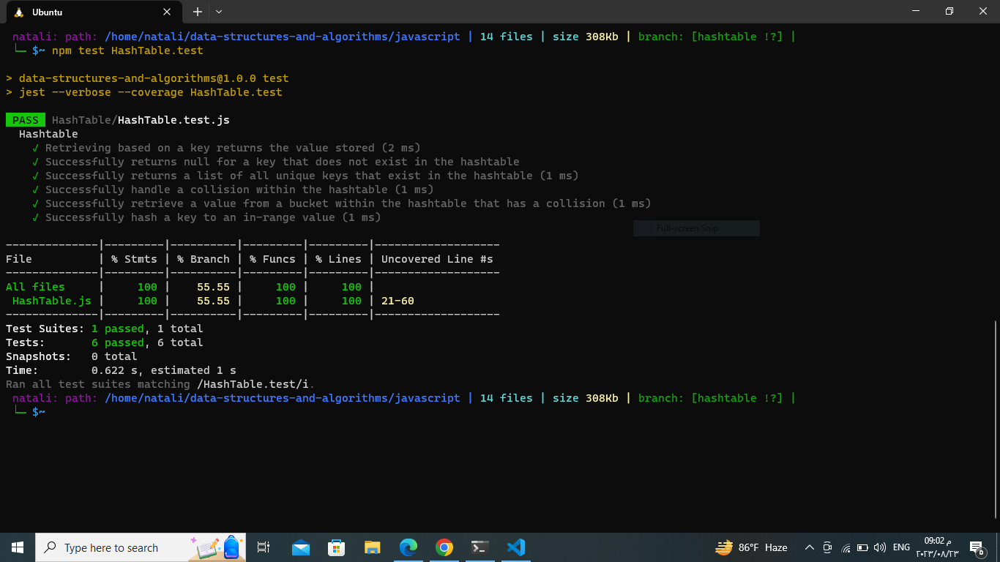

## Hash Table

### What is a Hashtable?
A hashtable (hash map), is a data structure that provides efficient data storage and retrieval by using a key-value mapping mechanism. 
In a hashtable, data is stored in an array-like structure, where each element is associated with a unique key. This key serves as an index, allowing for fast access to the corresponding value. 

### Importance of Fast Data Retrieval
One of the key advantages of hashtables is their ability to achieve fast data retrieval. Traditional array structures require iterating through the entire collection to find a specific element, resulting in linear time complexity. However, hashtables leverage a process called hashing to map keys to specific indices in the underlying array. This process allows for constant-time average case performance in retrieval operations. In essence, hashtables dramatically reduce the time complexity for accessing and manipulating data.

### Defining Methods for Set, Get, Has, Keys, and Hash Operations:

* set(key, value) The set method adds a new key-value pair to the hashtable. If the key already exists, it updates the associated value.

* get(key) The get method retrieves the value associated with a given key.

* has(key) The has method checks whether a key exists in the hashtable.

* keys() The keys method returns an array of all unique keys in the hashtable.

* Hash Function
The hash function is a critical component of the hashtable as it determines how keys are mapped to indices in the array. A simple hash function could involve summing the ASCII values of the characters in the key:

### Code and Test files:

- [Code:](./HashTable.js)
- [Test:](./HashTable.test.js)

- 