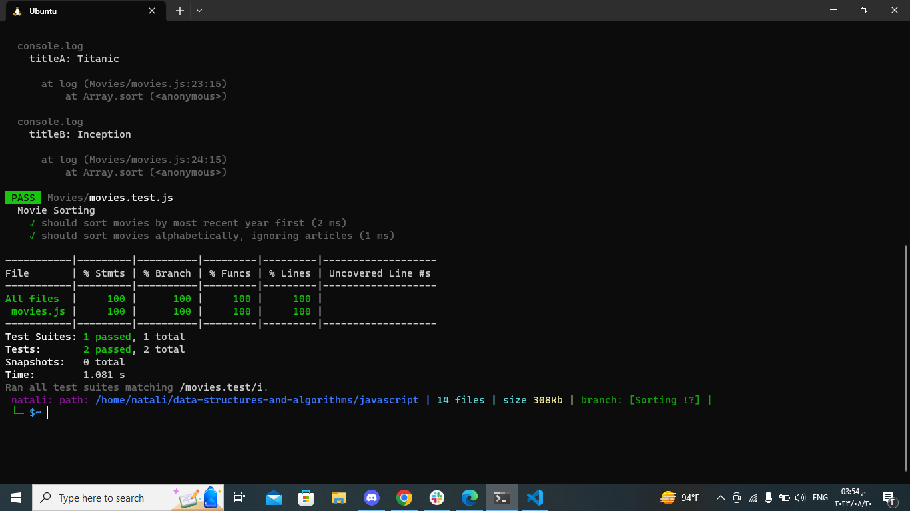

Part One: Sorting Movie Objects In this part of the challenge, you are tasked with writing two functions to sort an array of Movie objects. Each Movie object has properties: title (string), year (number), and genres (array of strings). The first function should sort the movies by the most recent year first. The second function should sort the movies alphabetically by title, while ignoring any leading articles like "A," "An," or "The." You should also provide test outputs for these functions and have a sample array of Movie objects for testing purposes.

Part Two: Testing Comparator Functions In the second half of the challenge, your objective is to create tests for the sorting functions you wrote in Part One. This might involve adjusting your code if needed. You will directly call the comparator functions and make assertions to ensure they produce the expected results when given specific input. The goal is to thoroughly test the sorting logic and confirm that it works as intended.

- [Movies.js](./movies.js)
- [testing](./movies.test.js)

