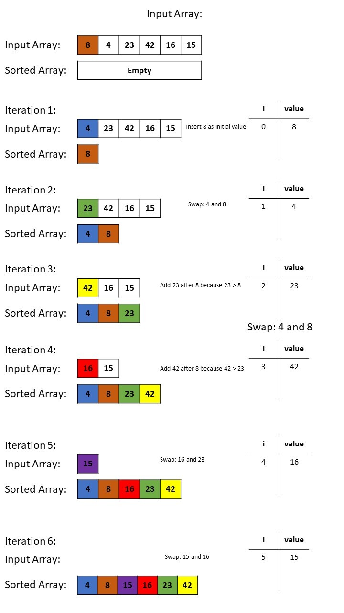

# Mastering Insertion Sort: Uniqueness in Sorting
Sorting algorithms play a pivotal role in computer science, enabling the organization of data for efficient search and retrieval. One popular algorithm is **Insertion Sort**, which we'll delve into in this article. We'll start by reviewing the provided pseudocode, followed by a visual walkthrough of the algorithm using a sample array with duplicate values. Then, we'll translate the pseudocode into a working JavaScript implementation and validate its accuracy through a series of tests.

## Refreshing Our Understanding of Insertion Sort
Before we dive in, let's recap Insertion Sort. It's an algorithm that builds the sorted sequence one element at a time. For each element, it finds the correct position within the sorted portion of the array and inserts it there.

## White board

## Understanding the Pseudocode
The provided pseudocode consists of two key functions: `Insert` and `InsertionSort`.

### Insert Function
The `Insert` function takes a sorted array (`sorted`) and a value to insert (`value`). It ensures that the value is placed at the appropriate position within the sorted array.
1. Initialize a variable `i` to 0.
2. While `value` is greater than `sorted[i]`, increment `i`.
3. Once the correct position is found, shift elements to the right to make room for `value`.
4. Insert `value` at the correct position.
5. Append `value` to the end if it's the largest element in the sorted array.

### InsertionSort Function
The `InsertionSort` function sorts an input array using the `Insert` function.
1. Create an empty array `sorted`.
2. Assign the first element of the input array to `sorted[0]`.
3. Iterate through the rest of the input array.
4. For each element, call the `Insert` function to insert it into the `sorted` array.
5. Return the sorted array.

## Visual Walkthrough with Duplicate Values
Let's walk through the Insertion Sort algorithm using a sample array with duplicate values: `[5, 12, 7, 5, 5, 7]`. We'll visualize each step of the algorithm's execution.

### Initial State
- `sorted`: Empty
- Input array: `[5, 12, 7, 5, 5, 7]`
### Iteration 1: Insert 5
- `sorted`: `[5]`
- Input array: `[12, 7, 5, 5, 7]`
### Iteration 2: Insert 12
- `sorted`: `[5, 12]`
- Input array: `[7, 5, 5, 7]`
### Iteration 3: Insert 7
- `sorted`: `[5, 7, 12]`
- Input array: `[5, 5, 7]`
### Iteration 4: Insert 5
- `sorted`: `[5, 5, 7, 12]`
- Input array: `[5, 7]`
### Iteration 5: Insert 5
- `sorted`: `[5, 5, 5, 7, 12]`
- Input array: `[7]`
### Iteration 6: Insert 7
- `sorted`: `[5, 5, 5, 7, 7, 12]`
- Input array: `[]`
### Final Sorted Array: `[5, 5, 5, 7, 7, 12]`

## Implementing Insertion Sort in JavaScript

[insertion.js](Insertion.js)

## Testing for Accuracy
[tests](../Sorting.test.js)

