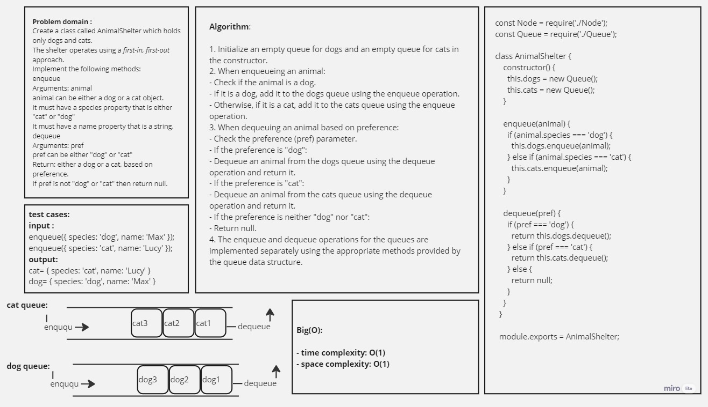
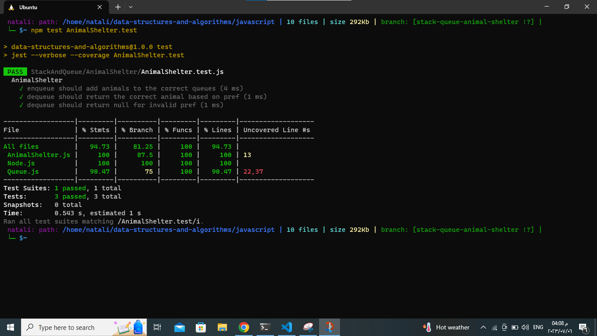

## sudoQueue

### describtion: 

The question is asking to create a class called AnimalShelter in JavaScript that holds only dogs and cats. The shelter operates using a first-in, first-out approach. The class should have two methods:

1. enqueue(animal): This method adds an animal (either a dog or a cat object) to the shelter. The animal object must have a species property that is either "cat" or "dog" and a name property that is a string.

2. dequeue(pref): This method removes and returns an animal from the shelter based on the given preference (pref). The preference can be either "dog" or "cat". If the preference is not "dog" or "cat", the method should return null.
___________________________________________________________________________________________________________
## Whiteboard Process:

## Approach & Efficiency:
the implementation has a simple and efficient approach using separate queues for dogs and cats, ensuring a first-in, first-out behavior while maintaining O(1) time complexity for enqueue and dequeue operations.
_________________________________________________________________________________________________________
## Solution:

1. [Node.js](./Node.js)
2. [Queue.js](./Queue.js)
3. [AnimalShelter.js](./AnimalShelter.js)
4. [tests](./AnimalShelter.test.js)

_ _ _
## testing image:

