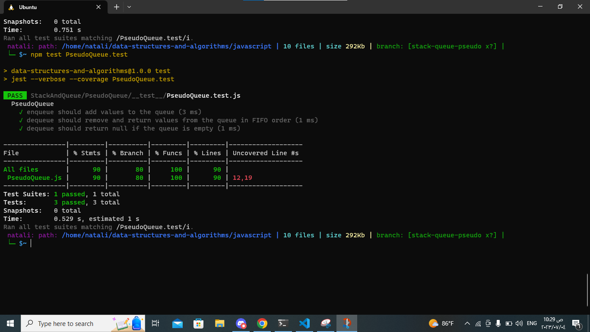

## sudoQueue

### describtion: 
A queue is a data structure that follows the First-In-First-Out (FIFO) principle, where the first element inserted is the first one to be removed. The PseudoQueue class aims to replicate this behavior using two stacks, which are data structures that follow the Last-In-First-Out (LIFO) principle.

The PseudoQueue class should provide two methods: enqueue and dequeue.

The enqueue method adds a value to the PseudoQueue, maintaining the FIFO order. It inserts the value into one of the stacks (referred to as stack1 in this implementation).

The dequeue method removes and returns a value from the PseudoQueue, also following the FIFO order. To achieve this, if stack2 (the second stack) is empty, it reverses the order of elements by transferring them from stack1 to stack2. Then it pops the topmost element from stack2 and returns it.

The problem domain involves correctly managing the two stacks to maintain the desired queue behavior. By implementing the PseudoQueue class, we aim to provide an alternative approach to implementing a queue without using a traditional queue data structure directly. Instead, we utilize the stack data structure to simulate a queue.
___________________________________________________________________________________________________________
## Whiteboard Process:

## Approach & Efficiency:
The PseudoQueue class uses two stacks (stack1 and stack2) to implement a queue. Here's a breakdown of the approach and efficiency considerations:

1. Approach:

The enqueue method simply pushes the value onto stack1, which maintains the order of insertion.
The dequeue method is where the main logic resides:
If both stack1 and stack2 are empty, the PseudoQueue is empty, and we return null.
If stack2 is empty, we need to reverse the order of elements to maintain FIFO. We transfer all elements from stack1 to stack2 using a while loop and the pop and push operations. This ensures the elements are in reverse order.
After reversing the order, we can simply pop the topmost element from stack2 and return it, as it corresponds to the first-in element in the original queue.

2. Enqueue: The enqueue operation has a time complexity of O(1) since it directly pushes the value onto stack1. There are no loops or additional operations involved.
Dequeue: The dequeue operation has a time complexity of O(n) in the worst case, where n is the number of elements in the queue. This is because if stack2 is empty, we need to transfer all elements from stack1 to stack2. However, on subsequent dequeue operations, the time complexity becomes O(1) since we can directly pop the element from stack2.
Space Complexity: The space complexity for the PseudoQueue class is O(n), where n is the number of elements in the queue. This is because the elements are stored in the two stacks, and in the worst case, all elements need to be stored in either stack1 or stack2.
_________________________________________________________________________________________________________
## Solution:

1. [LinkedList.js](./PseudoQueue.js)
2. [tests](./__test__/PseudoQueue.test.js)

_ _ _
## testing image:

