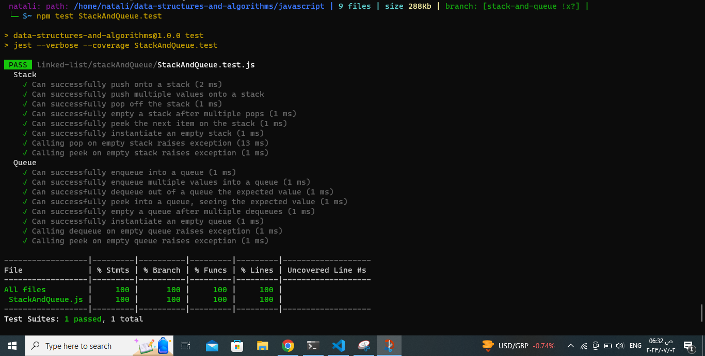

## Implementation: Stacks and Queues
## Description:
implementing a Stack and a Queue data structure using a Linked List as the underlying data storage mechanism.
- where The Stack class should have the following methods:
push(value): Adds a new node with the given value to the top of the stack in O(1) time complexity.
pop(): Removes and returns the value from the node at the top of the stack. Raises an exception if called on an empty stack.
peek(): Returns the value from the node at the top of the stack without removing it. Raises an exception if called on an empty stack.
isEmpty(): Returns a boolean indicating whether or not the stack is empty.

- The Queue class should have the following methods:
enqueue(value): Adds a new node with the given value to the back of the queue in O(1) time complexity.
dequeue(): Removes and returns the value from the node at the front of the queue. Raises an exception if called on an empty queue.
peek(): Returns the value from the node at the front of the queue without removing it. Raises an exception if called on an empty queue.
isEmpty(): Returns a boolean indicating whether or not the queue is empty.
Both the Stack and Queue classes should be able to handle multiple values being added or removed. Additionally, they should be able to handle cases where the stack or queue is empty and raise exceptions accordingly when attempting to perform operations such as popping or peeking on an empty stack/queue.

_ _ _
## Approach & Efficiency:
Overall, both the Stack and Queue operations have a time complexity of O(1) for their core operations, making them efficient for adding, removing, and accessing elements. The Linked List provides the necessary flexibility to achieve this efficiency.

_ _ _
## Solution
1. [Stack and Queue](./StackAndQueue.js)
2. [testing](./StackAndQueue.test.js)
_ _ _
