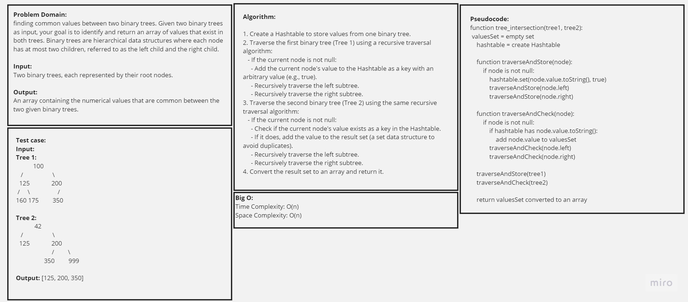
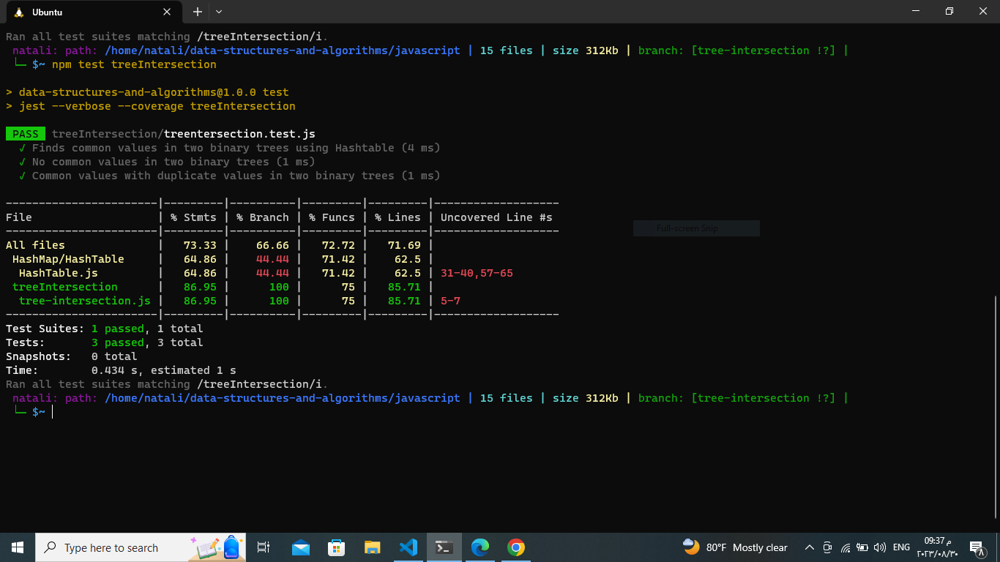

## Find common values in 2 binary trees

### Description:
 In this coding challenge, the goal is to find common values between two binary trees using a Hashtable (or HashMap) implementation. The challenge involves creating a function called tree_intersection that takes two binary trees as input and returns an array of values that are present in both trees. 
 _ _ _
### white board:
 
 _ _ _
### Approach & Efficiency
1. Create a Hashtable to store values from one binary tree.
2. Traverse the first binary tree and use the Hashtable to store its values as keys (with arbitrary values as values).
3. Traverse the second binary tree. For each node, check if its value exists in the Hashtable.
4. If a common value is found, add it to the result set.
Convert the result set to an array and return it.
_ _ _
### Solution:
[code](./tree-intersection.js)
[tests](./treentersection.test.js)
_ _ _
### Testing:

