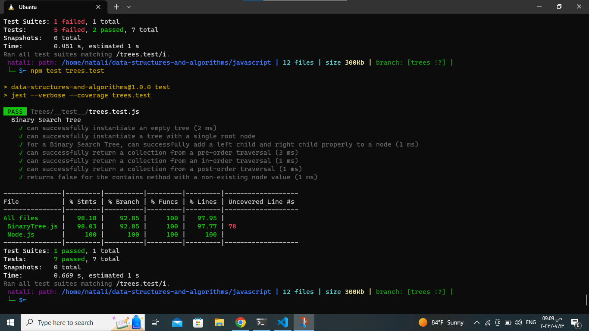

## Trees :

1. describtion: thw question asks for implement a classes and methods related to binary trees and binary search trees,
The features mentioned in the question involve the implementation of three main classes: Node, BinaryTree, and BinarySearchTree.
Node:
- The Node class represents a single node in a binary tree. It has three properties:
value,left,right.
Binary Tree:
- The BinaryTree class represents a binary tree and provides methods for performing depth-first traversals. It includes the following methods:
preOrder(),inOrder(),postOrder().
- Binary Search Tree:
The BinarySearchTree class extends the BinaryTree class and adds additional methods specific to a binary search tree. It includes the following methods:
add(value),contains(value),

___________________________________________________________________________________________________________
## Approach & Efficiency:
1. Node:
The Node class has a simple implementation with three properties: value, left, and right. and the efficiency is constant (O(1)) for accessing the properties.

2. Binary Tree Traversals (preOrder, inOrder, postOrder):
The depth-first traversal methods (preOrder, inOrder, and postOrder) use recursive algorithms to traverse the binary tree and collect the node values in the desired order.
- The time complexity of each traversal method is O(n), where n is the number of nodes in the binary tree. 
- The space complexity is also O(n) where n is the number of nodes. This is because the method uses the call stack to store recursive function calls.

3. Both the add and contains methods have a space complexity of O(h) due to the recursive calls on the call stack.where h is the hight of the tree.
_________________________________________________________________________________________________________
## Solution:
1. [node.js](../TreeCodes/Node.js)
2. [BinaryTrees.js](../TreeCodes/BinaryTree.js)
3. [test.js](../TreeCodes/__test__/trees.test.js)_________________________________________________________________________________________________________
## testing image:

