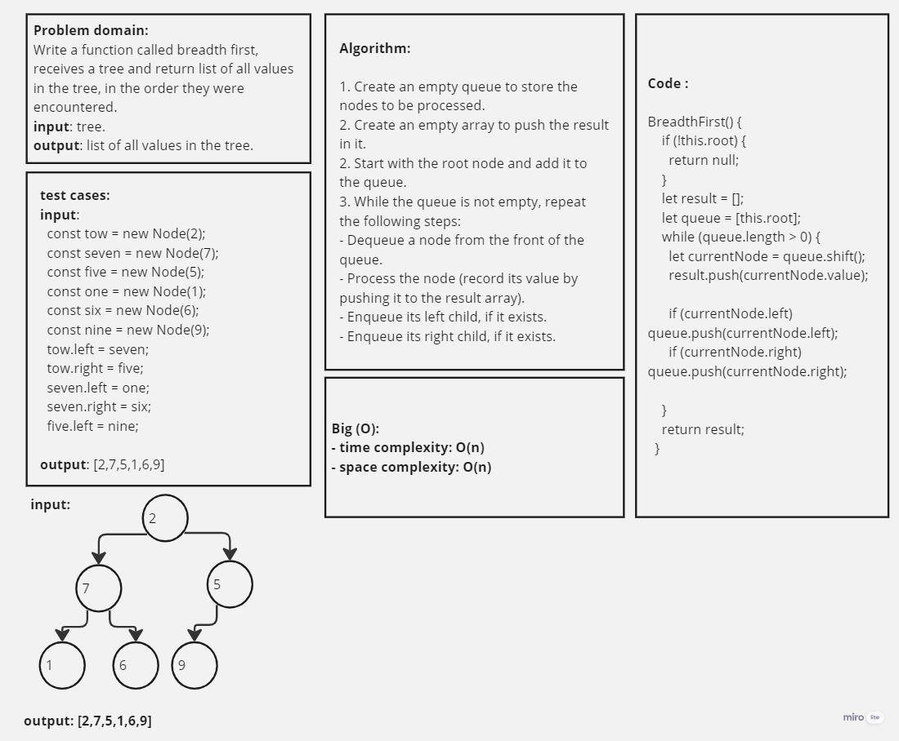
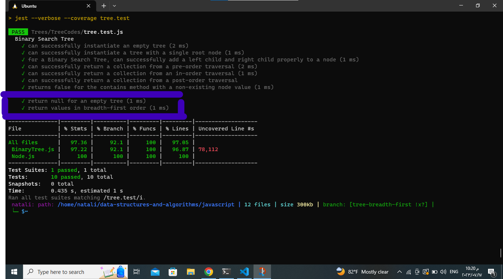

## Trees :

## Describtion
The question asks to traverse the tree using a method called "Breadth-first." This means you need to visit each node level by level, starting from the root and moving to its immediate children, then to their children, and so on. As you visit each node, you need to record its value in the order you encounter it.
___________________________________________________________________________________________________________
## White board:

___________________________________________________________________________________________________________
## Approach & Efficiency:
- Approach:
1. Create an empty queue to store the nodes to be processed.
2. Start with the root node and add it to the queue.
3. While the queue is not empty, repeat the following steps:
- Dequeue a node from the front of the queue.
- Process the node (record its value by pushing it to the result array).
- Enqueue its left child, if it exists.
- Enqueue its right child, if it exists.

- Efficiency:
The efficiency of this approach is O(n), where n is the number of nodes in the binary tree
_________________________________________________________________________________________________________
## Solution:
1. [BreadthFirst.js](./BreadthFirst.js)
2. [test.js](../TreeCodes/tree.test.js)_________________________________________________________________________________________________________
## testing image:

