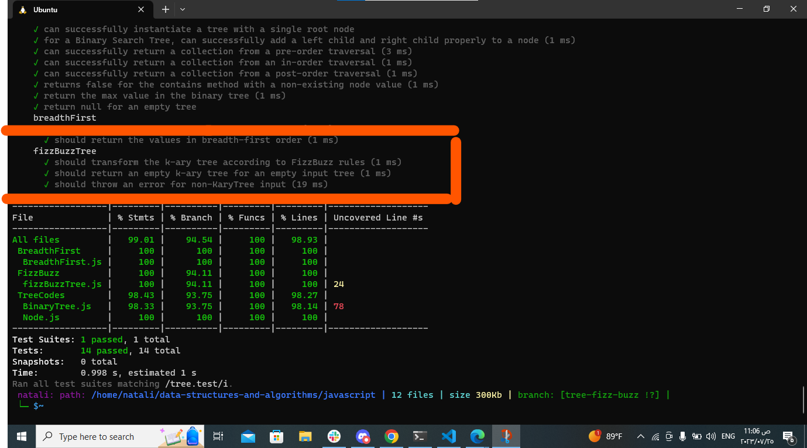

## fizzBuzzTree :
**Description:**
The "FizzBuzz" problem involves conducting FizzBuzz on a k-ary tree while traversing through it to create a new tree. In this challenge, we are given a k-ary tree (a tree where each node can have multiple children) and we need to create a new k-ary tree with the same structure as the original tree. However, the values of the nodes in the new tree should be modified based on certain rules:
1. If the value is divisible by 3, replace the value with "Fizz".
2. If the value is divisible by 5, replace the value with "Buzz".
3. If the value is divisible by both 3 and 5, replace the value with "FizzBuzz".
4. If the value is not divisible by 3 or 5, simply turn the number into a string.
The goal is to transform the values of the nodes in the original k-ary tree according to the FizzBuzz rules and create a new tree with the modified values while maintaining the same structure.
**Summary:**
The "FizzBuzz" challenge involves transforming the values of nodes in a k-ary tree according to specific rules (Fizz, Buzz, FizzBuzz, or string representation) and creating a new k-ary tree with the modified values while keeping the same tree structure. The process includes traversing the original tree and applying the FizzBuzz rules to each node's value to obtain the new tree. The goal is to solve this problem efficiently using tree traversal algorithms and create a new tree that satisfies the specified conditions.
---
### White board:

_______________
**Approach:**
To solve the "FizzBuzz" problem for a k-ary tree, we can use a recursive approach. We'll traverse the original k-ary tree and perform the following steps for each node:
1. Check the value of the node.
2. If the value is divisible by both 3 and 5, set the node's value to "FizzBuzz".
3. If the value is divisible by 3, set the node's value to "Fizz".
4. If the value is divisible by 5, set the node's value to "Buzz".
5. If the value is not divisible by 3 or 5, set the node's value to its string representation.
After processing each node, we'll create a new node with the modified value and add it to the new k-ary tree while maintaining the same tree structure.
**Efficiency:**
Let's analyze the efficiency of the algorithm:
1. Time Complexity:
   - The time complexity of the recursive approach is O(N), where N is the number of nodes in the original k-ary tree.
   - For each node, we perform constant time operations (checking divisibility and modifying values), and since we visit each node once, the overall time complexity is O(N).
2. Space Complexity:
   - The space complexity of the recursive approach is O(H), where H is the height of the original k-ary tree.
   - In the worst case, when the k-ary tree is a linear chain, the height H is equal to N (number of nodes), resulting in O(N) space complexity.
   - The space complexity is dominated by the call stack used for recursion.
   - Apart from the call stack, the algorithm uses additional space for the new k-ary tree, which is also O(N) since it has the same number of nodes as the original tree.
Overall, the algorithm has a time complexity of O(N) and a space complexity of O(N) in the worst case. It provides an efficient solution to create a new k-ary tree with modified values based on the FizzBuzz rules while maintaining the original tree's structure.
_____________________________
1. [fizzBuzzTree](./fizzBuzzTree.js)
2. [FizzBuzz.test](../TreeCodes/tree.test.js)
____________________
### testing image:
