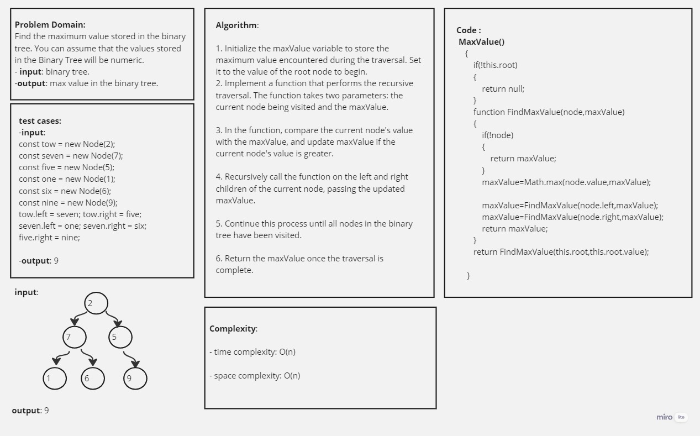
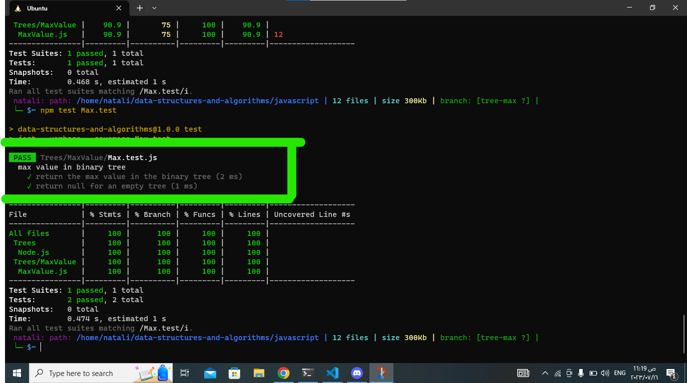

## Trees :

## Describtion
The question asks to find the maximum value in a binary tree. A binary tree is a hierarchical data structure consisting of nodes, where each node can have at most two children: a left child and a right child. Each node contains a numeric value. The goal is to write a method in the BinaryTree class that finds the maximum value stored in the tree.

___________________________________________________________________________________________________________
## White board:

___________________________________________________________________________________________________________
## Approach & Efficiency:
- Approach:
1. Initialize the maxValue variable to store the maximum value encountered during the traversal. Set it to the value of the root node to begin.

2. Implement a function that performs the recursive traversal. The function takes two parameters: the current node being visited and the maxValue.

3. In the function, compare the current node's value with the maxValue, and update maxValue if the current node's value is greater.

4. Recursively call the function on the left and right children of the current node, passing the updated maxValue.

5. Continue this process until all nodes in the binary tree have been visited.

6. Return the maxValue once the traversal is complete.

- Efficiency:
The efficiency of this approach is O(n), where n is the number of nodes in the binary tree
_________________________________________________________________________________________________________
## Solution:
1. [node.js](../Node.js)
2. [Max methode.js](./MaxValue.js)
3. [test.js](./Max.test.js)_________________________________________________________________________________________________________
## testing image:

