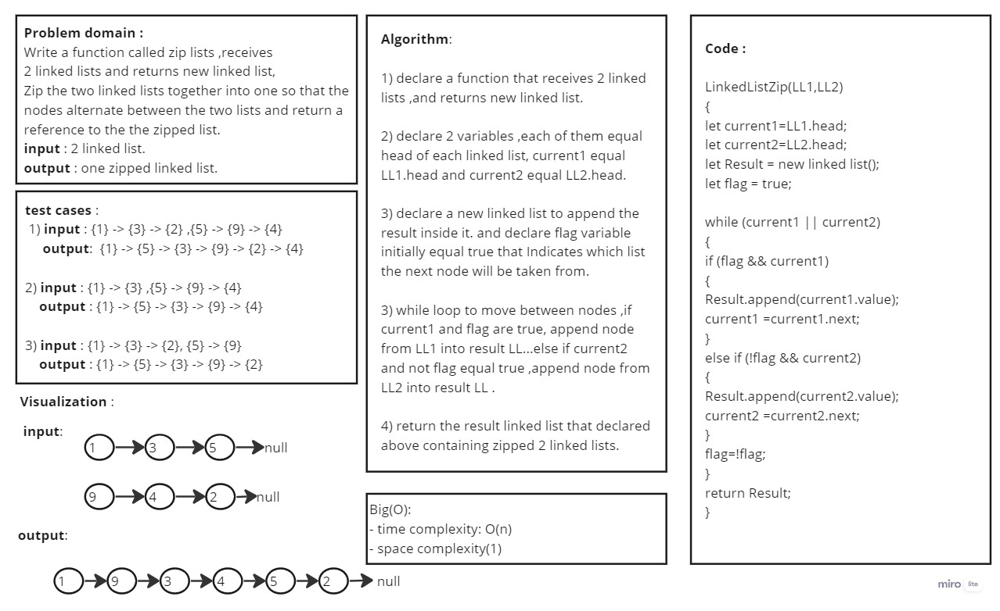
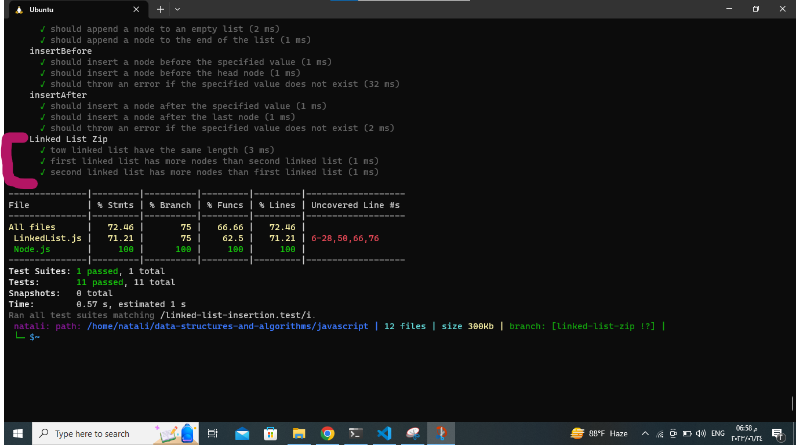

# Code Challenge: Class 08
## linked list Zip
1.   Summary:
                The challenge requires implementing method for the Linked List class: linkedListZip . The linkedListZip(LL1,LL2) method  recevies 2 linked lists and should return new linked list that zip 2 linked lists togather.

## Whiteboard Process

## Approach & Efficiency
- The approach used in the zipLists function is a straightforward iterative approach. It iterates over the nodes of the input lists, alternately selecting nodes from each list and appending them to the result list. The process continues until both input lists have been fully traversed.

- The efficiency of this approach is as follows:

Time Complexity: O(n), where n is the total number of nodes in both input lists. Since the function iterates over each node in the input lists exactly once, the time complexity is linear with respect to the input size.

Space Complexity: O(1). The space complexity is constant because the additional space used by the function does not grow with the size of the input lists. The function only requires a fixed number of variables to track the current nodes and create the result list.

Overall, the function provides an efficient solution to zip two linked lists together while minimizing additional space usage.

## Solution:
1. [Node.js](../linked-list/LinkedListFunctions/Node.js)
2. [LinkedList.js](../linked-list/LinkedListFunctions/LinkedList.js)
3. [tests](../linkedListInsertions/__tests__/linked-list-insertion.test.js)
## Testing

