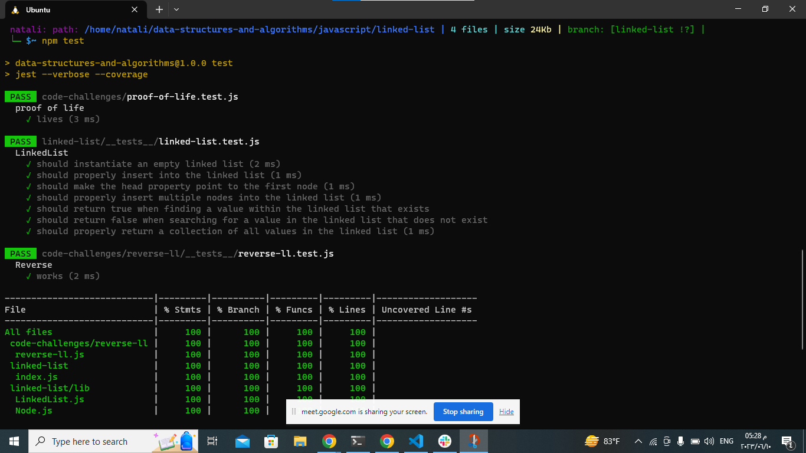

# Linked Lists:
### describtion: 
the task is to implement a Linked List class with several methods. A linked list is a linear data structure consisting of nodes, where each node contains a value and a reference to the next node in the sequence. The class should include the following methods:
1. insert(value): This method adds a new node with the given value to the head of the linked list. It should have a time complexity of O(1), meaning that the operation should take a constant amount of time, regardless of the size of the linked list.

2. includes(value): This method checks if a node with the given value exists in the linked list. It starts from the head of the list and iterates through the nodes until it finds a node with a matching value. It returns true if a matching node is found and false otherwise.

3. toString(): This method returns a string representation of the linked list, where each node's value is enclosed in curly braces and separated by arrows. The string ends with "NULL" to indicate the end of the list. For example, a linked list with values "a", "b", and "c" would be represented as "{ a } -> { b } -> { c } -> NULL".

### Summary:
 The class should include methods to insert nodes at the head, check if a value exists in the list, and convert the list to a string representation.

The challenge involves instantiating an empty linked list, inserting nodes at the head, maintaining proper linking of nodes, inserting multiple nodes, finding values within the list, and returning a formatted string representation of the list.
___________________________________________________________________________________________________________
## Whiteboard Process:

## Approach & Efficiency:
To implement the Linked List class with the required methods, the following approach can be taken:

Linked List Node:
- Create a Node class that represents a node in the linked list.
The Node class should have two properties: value to store the value of the node and next to reference the next node in the sequence.

Linked List:
1. Create a LinkedList class that will contain the implementation of the linked list.
The LinkedList class should have a head property to track the first node in the list.
Upon instantiation, the head should be set to null, representing an empty list.
Insertion:

2. To insert a new node at the head of the linked list, create a new instance of the Node class with the given value.
If the list is empty (i.e., head is null), set the head to the newly created node.
If the list is not empty, set the next property of the new node to the current head, and update the head to the new node.
The insertion operation has a constant time complexity of O(1) since it only involves updating a few references.
Searching:

3. To check if a value exists in the linked list, start from the head and iterate through the list, comparing the value of each node with the target value.
If a matching node is found, return true.
If the end of the list is reached without finding a match, return false.
The search operation has a linear time complexity of O(n), where n is the number of nodes in the list.
String Representation:

4. To convert the linked list to a string representation, start from the head and traverse the list, appending each node's value to a string in the desired format.
The traversal continues until reaching the end of the list, appending "NULL" to indicate the end.
The string representation operation has a linear time complexity of O(n), where n is the number of nodes in the list.

The time complexity of inserting a new node at the head of the list is O(1) because it does not depend on the size of the list. The time complexity of the includes method is O(n) in the worst case, where n is the number of nodes in the list, because it may need to traverse the entire list to find a match. The time complexity of the to_string method is also O(n) because it needs to traverse the entire list to build the string representation.
The space complexity of the linked list is O(n), where n is the number of nodes in the list, because we need to allocate memory for each node.
_________________________________________________________________________________________________________
## Solution:
1. [Node.js](./lib/Node.js)
2. [LinkedList.js](./lib/LinkedList.js)
3. [tests](./__tests__/linked-list.test.js)
4. [index.js](./index.js)

## teting image:

