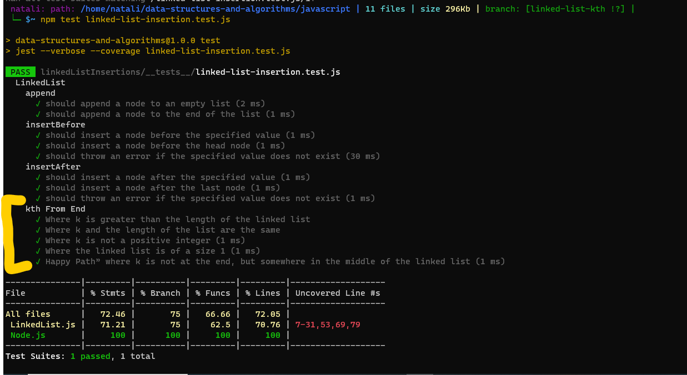

# Code Challenge: Class 07
## linked list kth
1.   Summary:
                The challenge requires implementing method for the Linked List class: kthFromEnd(k) . The kthFromEnd(k) method should return the value of the node that is k places from the tail of the linked list.
2. Description:
                kthFromEnd(k), takes a parameter k and returns the value of the node that is k places from the tail of the linked list.
## Whiteboard Process
.jpg)
## Approach & Efficiency
- For the kthFromEnd(k) method, one approach is to use two pointers, fast and slow. Initially, both pointers point to the head of the linked list. We move the fast pointer k positions ahead of the slow pointer. Then we move both pointers together until the fast pointer reaches the end of the linked list. At this point, the slow pointer will be k positions from the tail, and we return the value of the node it is pointing to.
## Solution:
1. [Node.js](../linked-list/LinkedListFunctions/Node.js)
2. [LinkedList.js](../linked-list/LinkedListFunctions/LinkedList.js)
3. [tests](../linkedListInsertions/__tests__/linked-list-insertion.test.js)
## Testing

