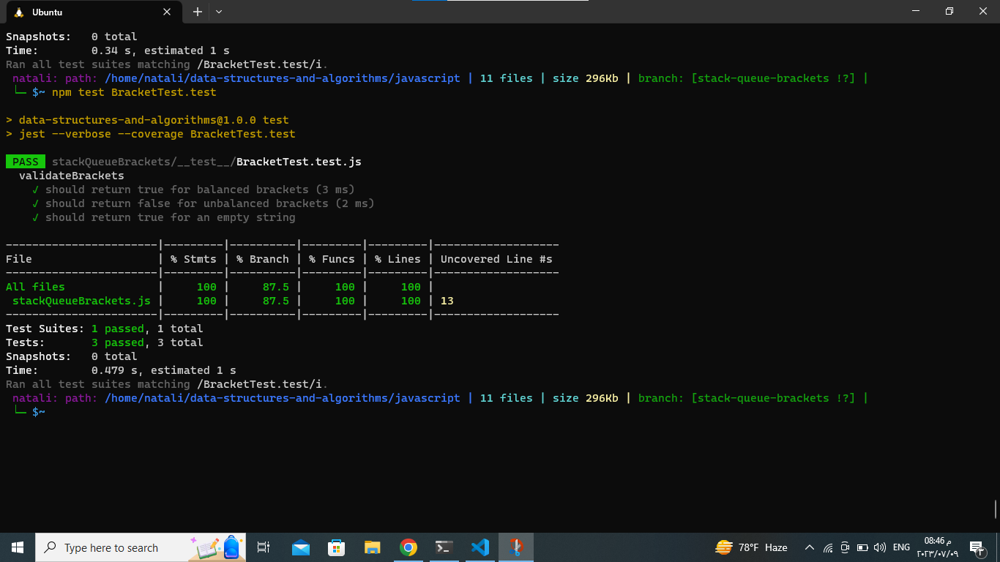

## stack-queue-brackets
### describtion: 
The question asks for a function called validateBrackets that takes a string as an argument. The function should return a boolean value indicating whether the brackets in the string are balanced or not.

There are three types of brackets: round brackets (), square brackets [], and curly brackets {}. The function should check if the brackets in the string are properly opened and closed in the correct order.

If all the brackets are balanced ,the function should return true. Otherwise, if there is any unmatched opening bracket, any closing bracket without a corresponding opening bracket, or mismatched brackets, the function should return false.
___________________________________________________________________________________________________________
## Whiteboard Process:

.jpg)

## Approach & Efficiency:
approach:
1. Create an empty stack.
2. Iterate through each character in the input string.
3. If the character is an opening bracket (i.e., '(', '[', or '{'), push it onto the stack.
4. If the character is a closing bracket (i.e., ')', ']', or '}'), check if the stack is empty or if the top of the stack does not match the corresponding opening bracket for the current closing bracket. If either of these conditions is true, the brackets are unbalanced, and we return false.
5. If the character is neither an opening nor a closing bracket, continue to the next character.
6. After iterating through all the characters, check if the stack is empty. If it is, all brackets are balanced, and we return true. Otherwise, there are unmatched opening brackets, and we return false.

efficiency:
- The time complexity of this approach is O(n), where n is the length of the input string. 
- The space complexity is O(n).
_________________________________________________________________________________________________________
## Solution:

1. [stack and queue .js](./stackQueueBrackets.js)
2. [test](./__test__/BracketTest.test.js)
_ _ _
## testing image:

